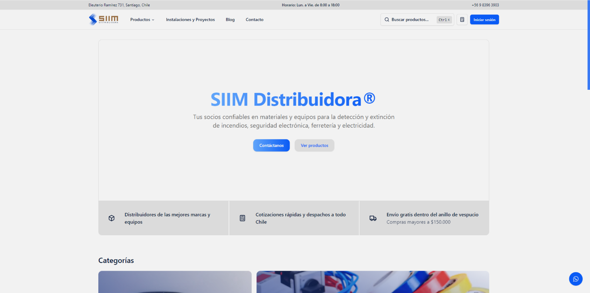

# [SIIM Distribuidora](https://siim-distribuidora.vercel.app/)

This is an open-source e-commerce build with everything new in Next.js 13. It is bootstrapped with `create-t3-app`.

<!--  -->

> **Warning**
> This project is still in development and is not ready for production use.
>
> It uses new technologies (server actions, drizzle ORM) which are subject to change and may break your application.

## Tech Stack

- [Next.js](https://nextjs.org)
- [Tailwind CSS](https://tailwindcss.com)
- [Clerk Auth](https://clerk.dev)
- [Drizzle ORM](https://orm.drizzle.team)
- [React Email](https://react.email)
- [uploadthing](https://uploadthing.com)
- [Stripe](https://stripe.com)

## Features

- Authentication with Clerk
- File uploads with uploadthing
- Newsletter subscription with React Email and Resend
- Subscription, payment, and billing with Stripe
- Storefront with products and categories
- Seller and customer workflows
- Admin dashboard with stores, products, orders, subscriptions, and payments
